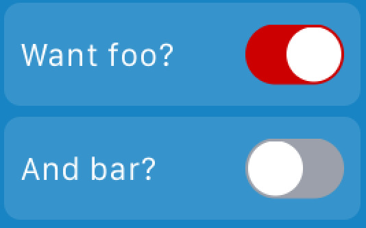
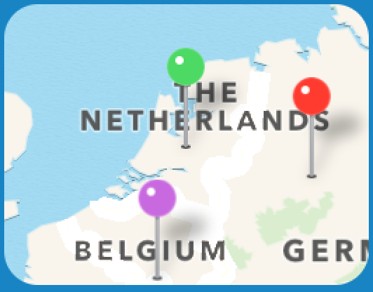
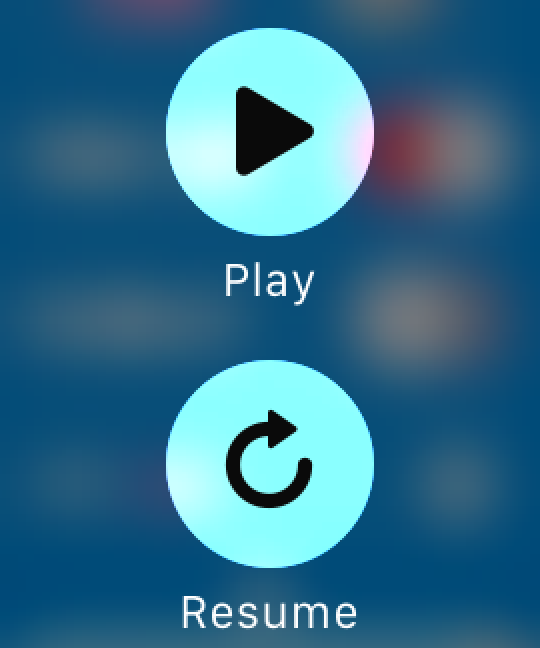
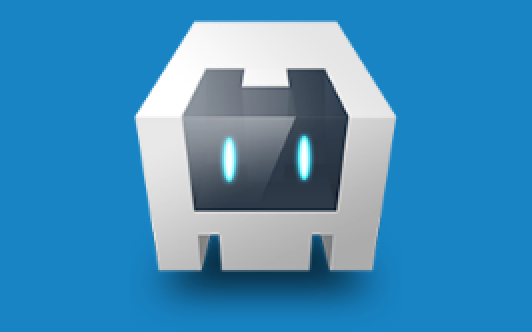
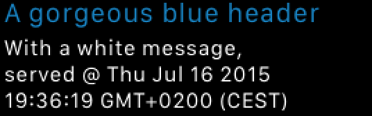
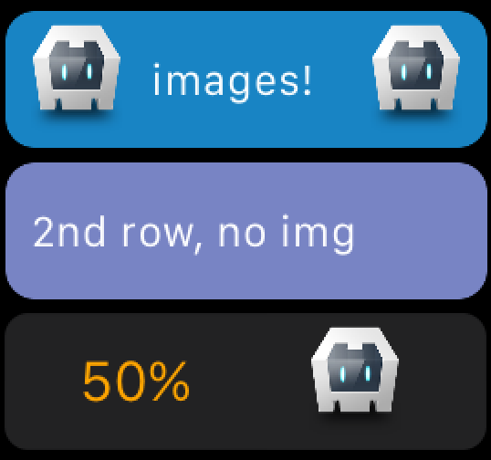
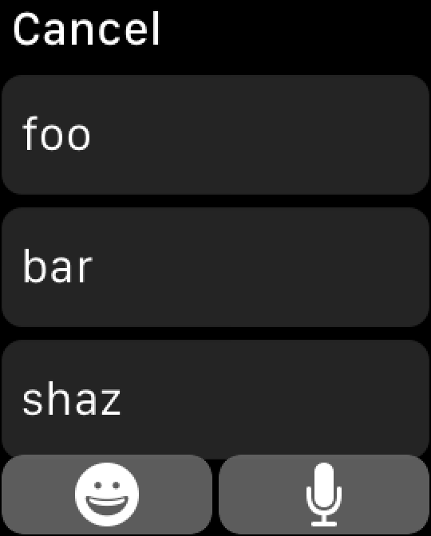
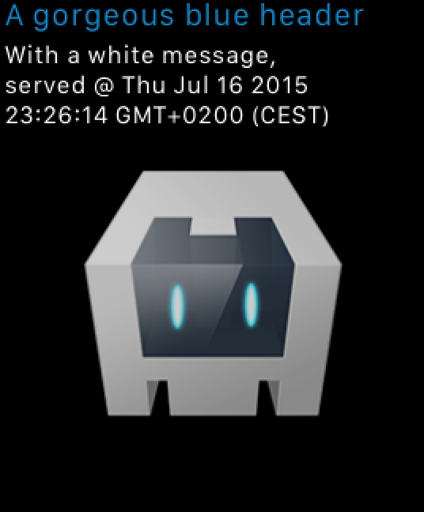

AppleWatch Cordova plugin
=========================

An AppleWatch plugin which requires no native code
as the Watch UI is built with plain old JavaScript.


##UI widgets
Let's start off with the fun stuff: how do we create Watch UI widgets with JavaScript?


####Common properties
All widgets support the following properties, which will mostly not be repeated below.

```js
{
  'alpha': 0.1, // barely visible, default is 1
  'width': 100, // pixels
  'height': 50  // pixels
}
```

####Switch


```js
var fooSwitchOn = true;
var barSwitchOn = false;

function onFooSwitchChanged(changedTo) {
  fooSwitchOn = changedTo;
  console.log("Foo switch changed to " + changedTo);
}

'switch': {
  'title': 'Want foo?',
  'on': fooSwitchOn, // the initial state of the switch when rendering
  'color': '#CC0000', // red in this case
  'callback': 'onFooSwitchChanged' // optional, but pretty useful
},
'switch2': {
  'title': 'And bar?',
  'on': barSwitchOn,
  'color': '#02779E'
}
 ```

####Slider


```js
var sliderValue = 50;

function onSliderChanged(val) {
  sliderValue = val;
  console.log("Slider changed to: " + val);
}

'slider': {
  'steps': 20, // of 100, so each step is 5 in this case
  'value': sliderValue, // of 100, making this essentially a percentage
  'color': '#CC0000', // the color of the dots, red in this case
  'callback': 'onSliderChanged',
  'hideValue': false // default false, shows the current value below the slider
}
 ```

####Map


```js
'map': {
  'center': {
    // Amersfoort, The Netherlands
    'lat': 52.1851552,
    'lng': 5.3996181
  },
  'zoom': 4.1, // 0.001 is streetlevel, 4 fits the entire Netherlands
  'annotations': [ // up to 5 annotations (custom pins), any more are ignored (play with the zoom value to make them all fit)
    {
      'pinColor': 'green', // green | red | purple
      'lat': 52.1851,
      'lng': 5.3996
    },
    {
      'pinColor': 'red',
      'lat': 51.751,
      'lng': 8.4
    },
    {
      'pinColor': 'purple',
      'lat': 50.2251,
      'lng': 4.7196
    }
  ]
}
 ```

####Menu


This menu is triggered by a Force Touch, which is pretty neat!

```js
function onContextMenuPlay() {
  console.log("User wants to play :)");
}

'contextMenu': {
  // configure up to 4 items (any more will be ignored)
  'items': [
    {
      'title': 'Play',
      'iconNamed': 'play', // see the table below
      'callback': 'onContextMenuPlay'
    },

    {
      'title': 'Resume',
      'iconNamed': 'resume',
      'callback': 'onContextMenuResume'
    }
  ]
}
```

The `iconNamed` property must be one of:

|`iconNamed`|image|
|-----------|-----|
|accept  ||
|add     ||
|block   ||
|decline ||
|info    ||
|maybe   ||
|more    | |
|mute    ||
|pause   ||
|play    ||
|repeat  ||
|resume  ||
|share   ||
|shuffle ||
|speaker ||
|trash   ||


####Image


Currently the image must reside in the www folder of your app.
In the future we may add support for loading images from other locations (like the Internet).

```js
'image': {
  // by not passing width and height the image is shown full size
  'src': 'www/img/logo.png'
}
```


####Label


The label at the top is called `label`,
you can add a second one (with a different style perhaps) by adding a `label2`.

```js
'label': {
  'value': 'A gorgeous blue header',
  'color': '#1884C4',
  'font': { // optional
    'size': 10
  }
},
'label2': { // optional, max 2 lines
  'value': 'With a white message, served @ ' + new Date(),
  'color': '#FFFFFF',
  'font': {
    'size': 8
  }
},
}
```


####Table


This widget gives you more control over the layout,
because a table may contain any number of rows, one or two columns,
and a lable, and image, or both inside each row.

```js
function onTableRowSelected(index) {
  console.log('Selected table row index: ' + index);
}

'table': {
  'callback':'onTableRowSelected',
  'rows': [

    // first row
    {
      'type': 'OneColumnRowType', // see the table below
      // this element defines properties for the entire row
      'group': {
        'backgroundColor': '#1884C4',
        'cornerRadius': 8
      },
      'label': {
        'value':'  images!' // unlike in HTML, multiple spaces have effect
      },
      'imageLeft': {
        'src': 'www/img/logo.png',
        'width': 25,
        'height': 30
      },
      'imageRight': {
        'src': 'www/img/logo.png', // boring, same image again :)
        'width': 25,
        'height': 30
      }
    },

    // second row
    {
      'type': 'OneColumnSelectableRowType',
      'group': {
        'backgroundColor': '#7884C4',
        'cornerRadius': 8
      },
      'label': {
        'value':'2nd row, no img'
      }
    },

    // third row
    {
      'type': 'TwoColumnsRowType',
      'col1label': {
        'value': '50%',
        'color': '#FFA500',
        'font': {
          'size': 16
        }
      },
      'col2image': {
        'src': 'www/img/logo.png',
        'width': 25,
        'height': 30
      }
    }
  ]
}
```

The row's `type` attribute must be one of:

|`type`|Description|
|-----------|-----|
|OneColumnRowType |A readonly row which can contain images and a lable.|
|TwoColumnsRowType |A readonly row with two evenly distributed columns. Each column can contain a centered label and/or image.|
|OneColumnSelectableRowType |Same as `OneColumnRowType` but the entire row is 'clickable'. Once that's done, a `callback` specified on the table level will be invoked. Don't add this to a glance since those are readonly.|
|Need something else?|This element is easily extensible, so please let us know what you want to see here..|


####Button


All types of buttons can be styled with a bunch of properties.
Those buttons above are rendered by this code:

```js
// the red one
'userInputButton': {
  'width': 60, // default full width, see the orange buttons
  'height': 30,
  'title': {
    'value': 'Vote',
    'color': '#FFFFFF',
    'font': {
      'size': 12
    }
  },
  'backgroundColor': '#CC0000',
  'alpha': 1 // which is the default
},

// the blue one
'actionButton': {
  'title': {
    'value': 'Refresh',
    'color': 'blaaaaaaa', // because this is rubbish, we fall back to the default (black)
    'font': {
      'size': 17
    }
  },
  'color': '#FFFFFF',
  'width':80,
  'height':44
},

// the orange one
'pushNavButton': {
  'title': {
    'value': 'Push nav'
  },
  'backgroundColor': '#FFA500'
}
```

#####UserInputButton


The `userInputButton` can be used to get input from the user (duh).

```js
function onUserInput(result) {
  if (result.type == "base64img") {
    console.log("An animated Emoji was selected");
    // you can show the image, for example add this:  and do this:
    document.getElementById("myImage").src = result.data;
  } else {
    // one of the pre-cooked anwers was picked, or a (non animated) Emoji, or even some fancy speech-to-text (dictation)
    feedback("User input: " + result.data);
  }
}

// the same button as (the red one) shown before , but without the layout bits
'userInputButton': {
  'inputMode': 'WKTextInputModeAllowAnimatedEmoji', // see the table below for options
  'suggestions': ['foo', 'bar', 'shaz'], // 0-3 possible suggestions
  'title': {
    'value': 'Vote',
  },
  'callback': 'onUserInput'
}
```

The `inputMode` attribute must be one of:

|`inputMode`|Description|
|-----------|-----|
|WKTextInputModePlain | Dictation/suggested text only. The emoji button will be hidden. If you don't provide `suggestions` the dictation interface will be shown directly.|
|WKTextInputModeAllowEmoji |Dictation, suggested text, and non-animated emoji.|
|WKTextInputModeAllowAnimatedEmoji |Dictation, suggested text, and both animated and non-animated emoji.|


#####ActionButton

Of course you can do anything you like when a user pressed a button.
Like fetching items from a remote server and navigating to a detail page on the watch.

```js
function onRefreshButtonPressed() {
  console.log("Reloading the page");
  applewatch.loadApp(payload);
}

'actionButton': {
  'title': {
    'value': 'Refresh!',
  },
  'callback': 'onRefreshButtonPressed'
}
```

#####Navigation button

There are two styles of navigation: 'push' and 'modal'.
The former performs a left-right slide animation and has a back button.
the latter stacks the new page on top of the other with a slide animation from the bottom and has a done/close button.

These buttons can only be used on the first app page and will navigate to the `AppDetail` page when activated.

######PushNavButton
```js
'pushNavButton': {
  'backTitle': 'Go Back', // optional, only an arrow is shown if not provided
  'title': {
    'value': 'Push nav'
  }
}
```

######ModalNavButton
```js
'modalNavButton': {
  'closeTitle': 'Shut it', // optional, and it's recommended to use the default 'Cancel' because that's shown a short moment anyway
  'title': {
    'value': 'Modal nav'
  }
}
```

##Loading a glance
Glances are readonly pages which can be accessed by swiping up from the watchface.
Your app can push content to the glance at any time and the watch will display the latest state it received.
Also, at the moment the glance is accessed by the user, the glance will request an update from your phone app
by invoking the `applewatch.callback.onLoadGlanceRequest` method. If you don't provide it the glance will remain black.



It's recommended that you do this on `deviceready` to configure the glance.
Take a look at [our demo](demo/index.html) if you want a complete example.

To create the UI shown above, do:

```js
function onGlanceRequestsUpdate() {
  var payload = {
    'label': {
      'value': 'A gorgeous blue header',
      'color': '#1884C4',
      'font': {
        'size': 10
      }
    },
    'label2': {
      'value': 'With a white message, served @ ' + new Date(),
      'color': '#FFFFFF',
      'font': {
        'size': 8
      }
    },
    'image': {
      'src': 'www/img/logo.png',
      'alpha': 0.8
    }
  };
  applewatch.loadGlance(payload);
}

applewatch.callback.onLoadGlanceRequest = onGlanceRequestsUpdate;
```

And here's a more concise way to configure a glance. In this case we'll only show an image.
```js
applewatch.callback.onLoadGlanceRequest = function() {
  applewatch.loadGlance({
    'image': {'src': 'www/img/logo.png'}
  });
}
```

Glances can't have buttons (the're readonly remember), so tapping anywhere on the glance will launch your app.

The allowed widgets and its order are precooked in the storyboard.
Unfortunately WatchKit doesn't allow dynamically created UI elements, but you can
throw a lot of items on a storyboard and show/hide them at will. That's what we're doing.

A glance is divided in two sections and can't show more than one page (they don't scroll).
The supported widgets are (in *this* rendering order, and they're all optional):

######Top section
|Variable name |Widget type|
|-----------|-----|
|label|Label|
|label2|Label|

######Bottom section
|Variable name |Widget type|
|-----------|-----|
|image|Image|
|table|Table|
|map|Map|

To be clear: this means you can't show a map above a table, but since the glance has very limit space
you probably only want one of those at a time anyway.


##Loading an app page
The basic idea is the same as the glance, but you have much more options.

So after `deviceready` has fired, you could do:
```js
applewatch.callback.onLoadAppMainRequest = function() {
var payload = {
  'label': {
    'value': 'Blue header label'
  },
  // you get the idea
};

applewatch.loadAppMain(payload);
```

And to load content into the app detail page:
```js
applewatch.callback.onLoadAppDetailRequest = function() {
  var payload = {..};
  applewatch.loadAppDetail(payload);
}
```

###Page configuration
The pages have a little optional configuration to tweak your app even more:
```js
var payload = {
  'group': { // the page wrapper. The defaults are probably best though.
    'backgroundColor':'#1884C4', // override the black background color
    'cornerRadius': 0 // make your app square (the default has radius 4-ish)
  },
  'title': 'My app', // show at the top of the page, the style can't be tweaked except in the storyboard itself
  // .. any other stuff on your page
};

```

######App main page
|Variable name |Widget type|
|-----------|-----|
|label|Label|
|image|Image|
|label2|Label|
|table|Table|
|switch|Switch|
|switch2|Switch|
|slider|Slider|
|map|Map|
|userInputButton|UserInputButton|
|actionButton|ActionButton|
|pushNavButton|PushNavButton|
|modalNavButton|ModalNavButton|

Note that since any unused variable is hidden we can easily add f.i. a 'label3'
at the bottom of this stack, or add an 'actionButton' below the other buttons.
You're welcome to request features like those and we'll try to add them
without making too much of a mess and remaining compatibility with current usage.

######App detail page
The same as the main page, except for the last two items (the navigation buttons).

##Navigating to an app page
Instead of updating the content of the current page with `loadApp` or `loadAppDetail`,
you may want to programmatically navigate to a different page. You were already able to
navigate from main to detail on the watch itself by adding a `pushNavButton` or `modalNavButton`,
but the phone app can instantiate navigation as well.

```js
// navigate from main to detail:
applewatch.navigateToAppDetail();

// to navigate back from detail to main:
applewatch.navigateToAppMain();
```

One usecase could be to have a table with selectable rows, and in the table callback function
you'd navigate to the detail page. Once the detail page loads the `applewatch.callback.onLoadAppDetailRequest`
function will fire so you can populate the detail page.

##Notifications
The watch can receive remote and local notifications.
 These can have buttons which have a callback that invokes your phone app.
 To register for receiving those callbacks, configure these functions:


```js
// local notifications
applewatch.callback.onLocalNotification = function(identifier) {..};

// remote notifications
applewatch.callback.onRemoteNotification = function(identifier) {..};

```

The `identifier` is the identifier specified in any custom button in your notification payload.

TODO elaborate and describe how to create a local notification.

##Using your own storyboard
If you want more control over the layout, you can open the `Interface.storyboard` file in XCode,
adjust it, and have the app load it by placing it here: `www/custom-watchkit-storyboards/Interface.storyboard`.


##Installation

####Prep
Install npm 'xcode' package because our hooks need it: `npm install -g xcode`

####CLI
```
 cordova create applewatchtest
 cd applewatchtest
 cordova platform add ios
```

####XCode
File > New > Target > Apple Watch: Language ObjC, Select Glance and Notifications > Finish > Activate

####CLI
```
 cordova plugin add https://github.com/Telerik-Verified-Plugins/AppleWatch
 cordova prepare
```

####XCode
Set CFBundleVersion (Bundle Version) and CFBundleShortVersionString (Bundle versions string, short) of all targets to the same value (use XCode's search feature and change all 3 .plist values)


At this point your builds should succeed


####More XCode
App Groups: register an appgroup in your iOS member center (Identifiers > App Groups): we expect group.<packagename>, like group.io.cordova.hellocordova, then add it to your App ID.
Now generate a provisioning profile with the new App ID and add it XCode (download, then double-click the file should do it).
In XCode, go to your targets and add this app group to both the phone and watch app targets (Capabilities tab).


##Tips:
If you want a quickstart, use `demo/index.html`

The simulator doesn't support local notifications

Debugging of both the app and the extension: http://www.fiveminutewatchkit.com/blog/2015/3/13/how-to-debug-an-ios-app-while-the-associated-watchkit-app-is-running

Notifications: http://natashatherobot.com/watchkit-actionable-notifications/


##Kudos
[Lee Crossley](https://github.com/leecrossley/cordova-plugin-apple-watch) for his work on figuring out how to add and use the wormhole lib in a Cordova plugin